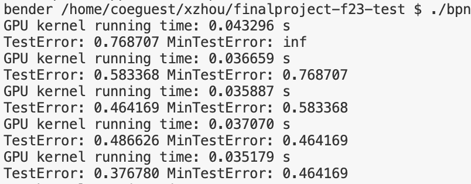
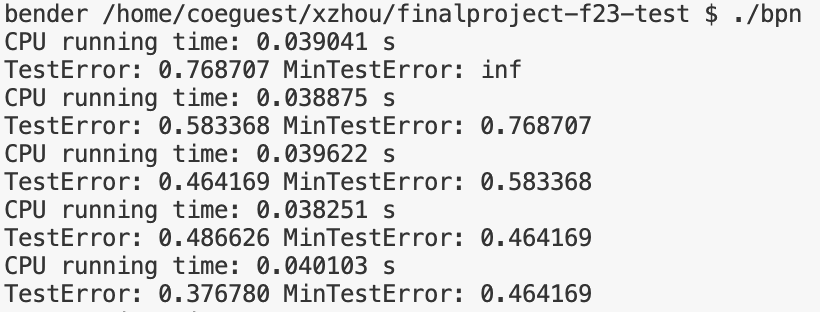
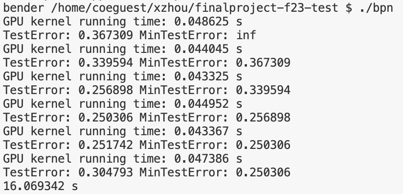
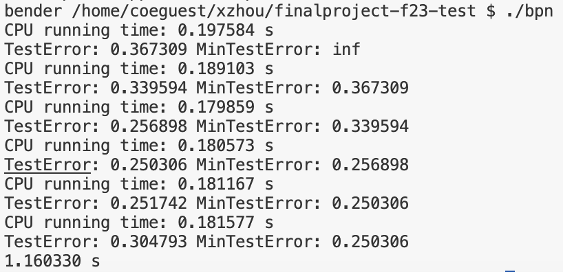

# CS217 Final Project report

**Team name**: VOID

**Group member**: Xingyan Zhou, Xinyu Zhang and Zhaorui Yang

**Project option**: Parallelizing serial C code with CUDA

# Project idea

The Backpropagation Network source code is a C language implementation of a neural network simulator, focusing on the backpropagation algorithm. It's primarily used for time-series forecasting, such as predicting the annual number of sunspots. The code includes the definition of the network structure, random number generation functions, and the core algorithms for learning and prediction.

We have thoroughly reviewed the source code and found that the backpropagation network consists of both propagation and backpropagation. As a result, we can parallelize the code in two directions. Additionally, we found several matrix and vector multiplications that we had implemented in our assignments, we decided to integrated them into the project. The platform we have chosen is Bender. It’s a powerful platform and we have gotten familiar with it, since it helps us a lot in the assignment. We still want to use it in the final project. Furthermore, we're consider to implement a timer within the source code. This feature will help to compare the performance before and after modifications.

# Our works
### Implementation details

Below shows four major files we implemented.

**main.cu**
```C
#include <stdio.h>
#include <stdlib.h>
#include "support.h"
#include "propagate.cu"
#include "backpropagate.cu"

int main(int argc, char *argv[])
{
  NET  Net;
  int Stop;
  double MinTestError;

  InitializeRandoms();
  GenerateNetwork(&Net);
  RandomWeights(&Net);
  InitializeApplication(&Net);

  cudaMalloc((void**)&Net_d, sizeof(NET)*1);
  cudaDeviceSynchronize();

  Stop = FALSE;
  MinTestError = MAX_REAL;
  do {
    TrainNet(&Net, &Net_d, 10);
    TestNet(&Net, &Net_d);
    if (TestError < MinTestError) {
      fprintf(f, " - saving Weights ...");
      MinTestError = TestError;
      SaveWeights(&Net);
    }
    else if (TestError > 1.2 * MinTestError) {
      fprintf(f, " - stopping Training and restoring Weights ...");
      Stop = TRUE;
      RestoreWeights(&Net);
    }
  } while (NOT Stop);

  TestNet(&Net);
  EvaluateNet(&Net);
   
  FinalizeApplication(&Net);
}
```
**Code explanation:** This is the main function involving training, testing, and evaluating a network. It begains with initializing random numbers, generating NN structure and setting up parameters. After that, it allcates memory on GPU, training and testing with in loops. Finally, it will testing and evaluate reuslt with `EvaluateNet` and doing necessay cleanup.

**kernel.cu**
```C
#include <stdio.h>
#include "include.h"

#define TILE_SIZE 16

__global__ void PropagateLayerKernel(REAL* layerOutput, REAL* nextLayerOutput, REAL* weight, const REAL gain, const int units, const int nextUnits)
{
    int i = blockIdx.x * blockDim.x + threadIdx.x;
    
    if (i < nextUnits) {
        REAL sum = 0;
        for (int j = 0; j < units; j++) {
            sum += weight[i * units + j] * layerOutput[j];
        }
        nextLayerOutput[i] = 1 / (1 + exp(-gain * sum));
    }
}


void PropagateNetCUDA(NET *Net, NET *Net_d, int NUM_LAYERS)
{
    int blockSize = TILE_SIZE;

    for (int l = 0; l < NUM_LAYERS - 1; l++)
    {
        int units = Net->Layer[l]->Units;
        int nextUnits = Net->Layer[l + 1]->Units;
        int numBlocks = (nextUnits + blockSize - 1) / blockSize;

        int size = nextUnits * units;
    
        REAL *d_weight, *d_layerOutput, *d_nextLayerOutput;
        cudaMalloc((REAL**)&d_weight, size * sizeof(REAL));
        cudaMalloc((REAL**)&d_layerOutput, units * sizeof(REAL));
        cudaMalloc((REAL**)&d_nextLayerOutput, nextUnits * sizeof(REAL));

        cudaMemcpy(d_layerOutput, Net->Layer[l]->Output, units * sizeof(REAL), cudaMemcpyHostToDevice);
        cudaMemcpy(d_weight, Net->Layer[l + 1]->Weight, size * sizeof(REAL), cudaMemcpyHostToDevice);

        PropagateLayerKernel<<<numBlocks, blockSize>>>(d_layerOutput, d_nextLayerOutput, d_weight, Net->Gain, units, nextUnits);

        cudaMemcpy(Net->Layer[l + 1]->Output, d_nextLayerOutput, nextUnits * sizeof(REAL), cudaMemcpyDeviceToHost);
            
        cudaFree(d_layerOutput);
        cudaFree(d_nextLayerOutput);
        cudaFree(d_weight);
    }
}

__global__ void BackpropagateLayerKernel(REAL* output, REAL* error, REAL* weight, const REAL gain, int units, int prevUnits) {
    int i = blockIdx.x * blockDim.x + threadIdx.x;
    if (i < units) {
        REAL out = output[i];
        REAL err = 0;
        for (int j = 0; j < prevUnits; j++) {
            err += weight[j * units + i] * error[j];
        }
        error[i] = gain * out * (1 - out) * err;
    }
}

__global__ void AdjustWeightsKernel(REAL* output, REAL* error, REAL* weight, REAL* dWeight, const REAL eta, const REAL alpha, const int units, const int prevUnits) {
    int i = blockIdx.x * blockDim.x + threadIdx.x;
    if (i < units) {
        for (int j = 0; j < prevUnits; j++) {
            REAL out = output[j];
            REAL err = error[i];
            REAL dW = dWeight[i * prevUnits + j];
            weight[i * units + j] += eta * err * out + alpha * dW;
            dWeight[i * units + j] = eta * err * out;
        }
    }
}

void BackpropagateNetCUDA(NET *Net, int NUM_LAYERS)
{
    int blockSize = TILE_SIZE;

    for (int l = NUM_LAYERS - 1; l > 1; l--)
    {
        int units = Net->Layer[l]->Units;
        int prevUnits = Net->Layer[l - 1]->Units;

        int numBlocks = (prevUnits + blockSize - 1) / blockSize;

        int size = prevUnits * (units+1);
    
        REAL *d_weight, *d_dweight, *d_prevlayerOutput, *d_prevLayerError, *d_LayerError;
        cudaMalloc((REAL**)&d_weight, size * sizeof(REAL));
        cudaMalloc((REAL**)&d_dweight, size * sizeof(REAL));
        cudaMalloc((REAL**)&d_prevlayerOutput, prevUnits * sizeof(REAL));
        cudaMalloc((REAL**)&d_prevLayerError, prevUnits * sizeof(REAL));
        cudaMalloc((REAL**)&d_LayerError, units * sizeof(REAL));

        cudaMemcpy(d_prevLayerError, Net->Layer[l - 1]->Output, prevUnits * sizeof(REAL), cudaMemcpyHostToDevice);
        cudaMemcpy(d_prevlayerOutput, Net->Layer[l - 1]->Output, prevUnits * sizeof(REAL), cudaMemcpyHostToDevice);
        cudaMemcpy(d_weight, Net->Layer[l]->Weight, size * sizeof(REAL), cudaMemcpyHostToDevice);

        BackpropagateLayerKernel<<<numBlocks, blockSize>>>(d_prevlayerOutput, d_LayerError, d_weight, Net->Gain, units, prevUnits);
        AdjustWeightsKernel<<<numBlocks, blockSize>>>(d_prevlayerOutput, d_LayerError, d_weight, d_dweight, Net->Eta, Net->Alpha, units, prevUnits);
        // printf("jjj");
        // fflush(stdout);
        cudaMemcpy(Net->Layer[l]->Weight, d_weight, size * sizeof(REAL), cudaMemcpyDeviceToHost);
        cudaMemcpy(Net->Layer[l]->dWeight, d_dweight, size * sizeof(REAL), cudaMemcpyDeviceToHost);

        cudaFree(d_prevlayerOutput);
        cudaFree(d_prevLayerError);
        cudaFree(d_weight);
        cudaFree(d_dweight);
        cudaFree(d_LayerError);
    }
}
```
**Code explanation:** There are many key functions serve for the CUDA version of backpropagation network. ``PropagateLayerKernel`` computes the output of the propagation layer. It sums the products of weights and layer outputs, and then uses the sigmoid fuction $\frac{1}{1+(-gain)^{sum}}$ for activiation. ``PropagateNetCUDA`` manages the forward propagation for all layers. For each layer, it allocates GPU mem, copies data frpm host to device, calls another fuction and copies results back to host.``BackpropagateLayerKernel``Computes the error for each neuron in a layer. It uses the derivative of the sigmoid function and the errors from the following layer.``AdjustWeightsKernel``adjust the weights based on the calculated errors.``BackpropagateNetCUDA``is the reverse version of PropagateNetCUDA, it manages the backward propagation. It allocates memory, transfers data, and invokes the kernels in reverse order.

**supprot.cu**
```C
#include <stdint.h>
#include <stdlib.h>
#include <stdio.h>

#include "support.h"

void verify(float *A, float *B, float *C, unsigned int m, unsigned int k,
  unsigned int n) {

  const float relativeTolerance = 1e-6;
  unsigned int count = 0;

  for(int row = 0; row < m; ++row) {
    for(int col = 0; col < n; ++col) {
      float sum = 0;
      for(unsigned int i = 0; i < k; ++i) {
        sum += A[row*k + i]*B[i*n + col];
      }
      count++;
      float relativeError = (sum - C[row*n + col])/sum;
      //printf("%f/%f ", sum, C[row*n + col]);
      if (relativeError > relativeTolerance
        || relativeError < -relativeTolerance) {
        printf("\nTEST FAILED %u\n\n",count);
        exit(1);
      }
    }
  }
  printf("TEST PASSED %u\n\n", count);

}

void startTime(Timer* timer) {
    gettimeofday(&(timer->startTime), NULL);
}

void stopTime(Timer* timer) {
    gettimeofday(&(timer->endTime), NULL);
}

float elapsedTime(Timer timer) {
    return ((float) ((timer.endTime.tv_sec - timer.startTime.tv_sec) \
                + (timer.endTime.tv_usec - timer.startTime.tv_usec)/1.0e6));
}
```
**Code explanation:**``verify`` function checks the acciracy of matrix multiplication operation. It compares result against the expected result computed within the function. Additionaly, there are some other timer functions such as ``starTime`` and ``stopTime`` record the time spend, ``elapsedTime`` calculates the duration and provid the time in seconds.

**utils.cu**
```C
#include <stdio.h>

#define TILE_SIZE 16

__global__ void mysgemm(int m, int n, int k, const double *A, const double *B, double* C) {
    int tx = threadIdx.x + blockIdx.x * blockDim.x;

    if (tx < n) {
        double res_C = 0.0;

        for (int i = 0; i < k; i++) {
            res_C += A[i] * B[i * n + tx];
        }
        C[tx] = res_C;
    }
}

__global__ void sigmoid(const double* vec_size, double* vec_res)
{
    int idx = blockIdx.x * blockDim.x + threadIdx.x;
    
    if (idx < vec_size) {
        vec_res[idx] = 1.0 / (1.0 + exp(-vec[idx]));
    }
}

__global__ void sigmoid_d(const double* vec_size, const double* gain, const double* vec_in, double* vec_res)
{
    int idx = blockIdx.x * blockDim.x + threadIdx.x;
    
    if (idx < vec_size) {
        double sigmoid_val = vec_in[idx];
        vec_res[idx] = gain * sigmoid_val * (1.0 - sigmoid_val) * vec_res[idx];
    }
}

__global__ void ComputeOutputErrorKernel(REAL* output, REAL* target, REAL* error, REAL gain, int units)
{
    int i = threadIdx.x + blockIdx.x * blockDim.x;
    if (i < units) {
        REAL out = output[i];
        REAL err = target[i] - out;
        error[i] = gain * out * (1 - out) * err; // 计算误差梯度
    }
}

__global__ void mysgemm(int m, int n, int k, const double *A, const double *B, double* C) {

    /********************************************************************
     *
     * Compute C = A x B
     *   where A is a (m x k) matrix
     *   where B is a (k x n) matrix
     *   where C is a (m x n) matrix
     *
     * Use shared memory for tiling
     *
     ********************************************************************/

    int bx = blockIdx.x;
    int by = blockIdx.y;
    int tx = threadIdx.x;
    int ty = threadIdx.y;

    int row = by * TILE_SIZE + ty;
    int col = bx * TILE_SIZE + tx;

    float res_C = 0.0f;
    
    __shared__ float A_shared[TILE_SIZE][TILE_SIZE];
    __shared__ float B_shared[TILE_SIZE][TILE_SIZE];


    for (int t = 0; t < (k - 1) / TILE_SIZE + 1; t++)
    {
        if(row < m && t * TILE_SIZE + tx < k)
        {
            A_shared[ty][tx] = A[row * k + t * TILE_SIZE + tx];
        }
        else
        {
            A_shared[ty][tx] = 0.0;
        }

        if (col < n && t * TILE_SIZE + ty < k)
        {
            B_shared[ty][tx] = B[(t * TILE_SIZE + ty) * n + col];
        }
        else 
        {
            B_shared[ty][tx] = 0.0;
        }

        __syncthreads();

        for (int i = 0; i < TILE_SIZE; i++)
        {
            res_C += A_shared[ty][i] * B_shared[i][tx];
        }

        __syncthreads();
    }

    if(row < m && col < n)
    {
        C[row * n + col] = res_C;
    }
    __syncthreads();
}
```
**Code explanation:** This file contains some basic functions for matrix and vector multiplications. For example, sigmoid activision function``sigmoid``, sigmoid derivative function ``sigmoid_d`` and error calculation for output layer ``ComputeOutputErrorKernel``.

# Results
#### K = 100
- **GPU Results**:
  

- **CPU Results**:
  

#### K = 500
- **GPU Results**:
  

- **CPU Results**:
  

#### K = 1000
- **GPU Results**:
  

- **CPU Results**:
  

# Conclusion

Surprisingly, after our efforts, we found that there were no significant improvements in the overall running times. To investigate further, we focused on the running times for the propagation phase and discovered an unexpected result: the GPU running time was actually slower than the CPU running time. This led us to find the differences between the kernel, propagation, and serial running times.

For the kernel running time, which refers to the time taken for executing the core computation tasks on the GPU, was found to faster than propagation running time. This advantage was offset by the overheads associated with data transfer and memory management on the GPU, which are not present in CPU computations.

The propagation time showed a low performance. On the GPU, despite its parallel processing capabilities, the propagation was hindered by synchronization issues and the complex nature of data dependencies, leading to less efficient execution compared to the CPU.

The serial running time, which is the execution time on the CPU without parallelization, was consistently faster. This was attributed to the simpler architecture of the CPU that avoids the overheads present in GPU computations, and the nature of our tasks which might not have been ideally suited for parallelization.

These findings suggest that the optimization for GPU did not effectively leverage its parallel processing capabilities, and perhaps the tasks at hand were more suited for serial processing. Future efforts in optimization would need to carefully consider the nature of the tasks and the overheads involved in GPU computing.

# Contributions
| Name | contributions | works |
|----------|----------|----------|
| Xinyu Zhang    | 1/3    | Implementaion, Testing, Experiments, Report   |
| Xingyan Zhou    | 1/3     |Implementaion, Testing, Experiments, Report  |
| Zhaorui Yang   | 1/3     | Implementaion, Testing, Experiments, Report  |
